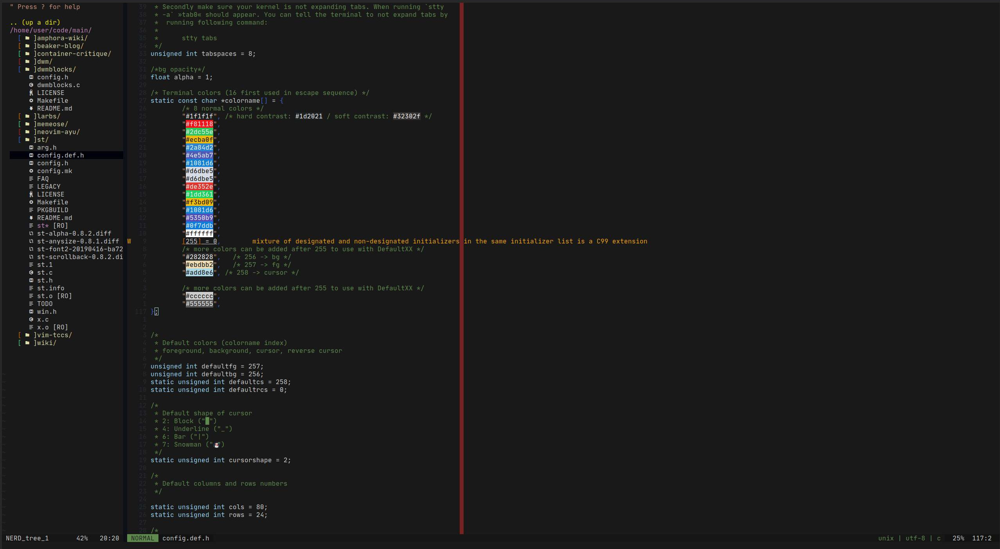

# .dotfiles



My debian-based/arch compatible server/root-account dotfiles.

## Required/Recommended Software

### Required

- git
- tmux
- neovim
- zsh
- eza
- sc-im (recommended)

#### Debian-based Systems

- `apt install git tmux neovim zsh`
- get the rest manually
  - [eza](https://github.com/eza-community/eza)
  - [sc-im (recommended)](https://github.com/andmarti1424/sc-im/wiki/Ubuntu-with-XLSX-import-&-export)

#### Arch-based Systems

- Get the yay-AUR-pckagemanager or something similar (`pacman -S yay`).
- `yay -S eza git tmux neovim zsh sc-im`

## Migration of my dotfiles to other system

- set alias in .bashrc: `alias config='/usr/bin/git --git-dir=$HOME/.dotfiles/ --work-tree=$HOME'`
- clone this repository: `git clone --bare https://github.com/Tiyn/dotfiles $HOME/.dotfiles`
- optional: backup old files:
```
mkdir -p .config-backup && \
config checkout 2>&1 | egrep "\s+\." | awk {'print $1'} | \
xargs -I{} mv {} .config-backup/{}
```
- checkout changes: `config checkout server`
- ignore untracked files: `config config --local status.showUntrackedFiles no`
- pull current setup: `config pull --set-upstream origin server`
- finish setup for vim:
  - open vim
  - `:PlugInstall`
  - `:CocInstall`
- change shell to zsh: `chsh -s /bin/zsh`
  - it is possible that you're asked for a password. If so you need to change
  the line in `/etc/pam.d/chsh` from `auth required pam_shells.so` to
  `auth sufficient pam_sehlls.so`
