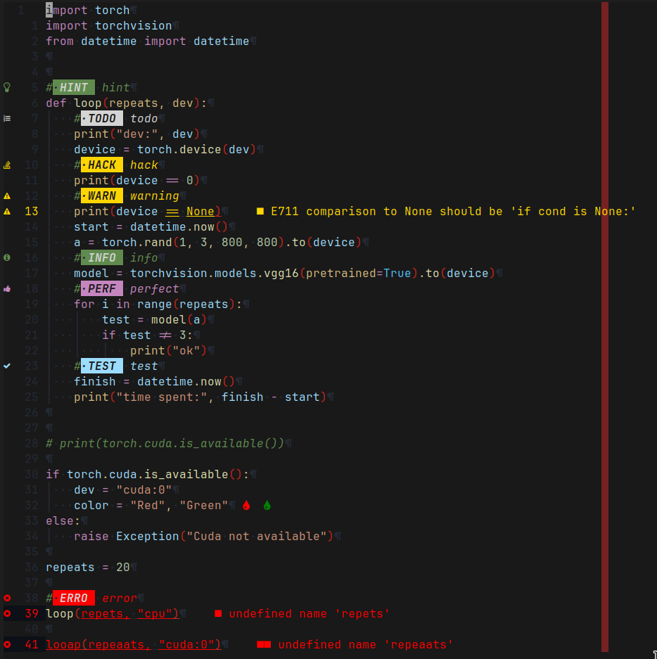

# Dotfiles



My Arch Linux compatible user dotfiles.
They were originally based on the dotfiles of
[lukesmithxyz](https://github.com/lukesmithxyz/voidrice).
This being some time, hundreds of commits and my personalized version of
[larbs](https://github.com/Tiyn/larbs) ago, they are now quite different.

## Default Programs

The following are some of the main programs that are installed by using this install script.

- Operating System: `Arch Linux`
- Window Manager: `dwm`
- Audio Server: `pipewire`
- Shell: `zsh`
- Terminal Emulator: `st`
- File Manager: `vifm`
- Application Launcher: `dmenu(_run)`
- Status Bar: `dwmblocks`
- Notification Service: `dunst`
- Text Editor: `neovim`
- Reader: `zathura`
- Browser: `zen-browser`
- Lockscreen: `slock`
- Hotkey Service: `sxhkd`

All requirements and recommendations get installed by my version of LARBS.
To take a look at all the software it installs look at the
[progs.csv](https://github.com/Tiyn/larbs/blob/master/progs.csv)  in my LARBS repository.

## Migration of my Dotfiles to Other System

- set alias in .bashrc: `alias config='/usr/bin/git --git-dir=$HOME/.dotfiles/ --work-tree=$HOME'`
- clone this repository: `git clone --bare https://github.com/Tiyn/dotfiles $HOME/.dotfiles`
- optional: backup old files:

```sh
mkdir -p .config-backup && \
config checkout 2>&1 | egrep "\s+\." | awk {'print $1'} | \
xargs -I{} mv {} .config-backup/{}
```

- checkout changes: `config checkout`
- ignore untracked files: `config config --local status.showUntrackedFiles no`
- pull current setup: `config pull`
- finish setup for vim:
  - open vim

The step containing commenting out is needed because the colorscheme has
problems being not available and disrupts the further process of the plugin
installation.

## Ignore Local Changes to Config Files

If you need to make local changes to config files that are not to be pushed
run `config update-index --skip-worktree <file>` to stop git from showing them
having changes.

## Hotkeys

There are various shortcuts and hotkeys used in this version. Included in my build are the following.
[dwm](https://github.com/tiyn/dwm) and [st](https://github.com/tiyn/st)s hotkeys can be found in their repositories.
For Wayland [dwl](https://github.com/tiyn/dwl) is used instead of dwml.

### Hotkey Daemon

The default hotkey daemon is `sxhkd`.
For Wayland `swhkd` is used instead.

| ModKey | Shift | Key               | Function                                                  |
| ------ | ----- | ----------------- | --------------------------------------------------------- |
| Super  |       | a                 | (sounds) Previous song                                    |
| Super  |       | b                 | (program) Spawn browser                                   |
| Super  |       | c                 | (sounds) Toggle looping of songs                          |
| Super  |       | d                 | (sounds) Next song                                        |
| Super  |       | f                 | (program) Spawn filemanager                               |
| Super  |       | i                 | (display) Stop recording                                  |
| Super  |       | m                 | (program) Spawn thunderbird                               |
| Super  |       | o                 | (display) Start replay window                             |
| Super  |       | p                 | (display) Save replay window                              |
| Super  |       | u                 | (display) Start recording window                          |
| Super  |       | r                 | (program) Spawn dmenu\_run                                |
| Super  |       | s                 | (sounds) Pause song                                       |
| Super  |       | x                 | (sounds) Toggle shuffling of songs                        |
| Super  | Shift | b                 | (statusbar) Toggle statusbar (managed by dwm on x)        |
| Super  | Shift | l                 | (keyboard) Toggle keymap (managed by dwl on wayland)      |
| Super  | Shift | r                 | (sxhkd/swhkd) Restart sxhkd/swhkd                         |
| Super  | Shift | Space             | (notifications) Close all notifications                   |
| Super  |       | [                 | (notifications) Toggle dunst dnd                          |
| Super  |       | ]                 | (sounds) Toggle mute                                      |
| Super  |       | \                 | (sounds) Toggle deaf                                      |
| Super  |       | F5                | (display) Enable 2 Screen Monitor (not needed on wayland) |
| Super  |       | F6                | (keyboard) Toggle touchpad                                |
| Super  |       | F7                | (mounting) Mounting drives                                |
| Super  |       | F8                | (mounting) Unmounting drives                              |
| Super  |       | F9                | (network) Restart NetworkManager                          |
| Super  |       | F10               | (display) slock                                           |
| Super  |       | F11               | (shutdown) reboot                                         |
| Super  |       | F12               | (shutdown) shutdown                                       |
| Super  |       | Return            | (program) Spawn terminal                                  |
|        |       | Print             | (program) Prompt to take a screenshot                     |
|        |       | AudioMute         | (sound) Volume mute                                       |
|        |       | AudioMicMute      | (sound) Mic Mute (currently not on wayland)               |
|        |       | AudioLowerVolume  | (sound) Volume lower                                      |
|        |       | AudioRaiseVolume  | (sound) Volume raise                                      |
|        |       | MonBrightnessDown | (display) Brightness decrease (currently not on wayland)  |
|        |       | MonBrightnessUp   | (display) Brightness increase (currently not on wayland)  |

## Additional Configs

Additional configs (and for example firefox plugins) can be found in my
[wiki](https://github.com/tiyn/wiki).

## Additional Information

This section contains information regarding special configurations that will be enabled or
available by using these dotfiles.

### Audio Setup

This configuration features settings and profiles for
[easyeffects](https://github.com/tiyn/wiki/blob/master/wiki/linux/easyeffects.md).
Additionally to the flat profile there are also various profiles for headphones.
They mostly target to achieve curve similar to the
[harman curve](https://github.com/tiyn/wiki/blob/master/wiki/linux/audio.md#headphone-audio-profiles).

The following list matches the headphones and in-ear monitors to the base equalizer used.

- Beyerdynamic DT 1770 (Velour): [AutoEQ](https://github.com/tiyn/wiki/blob/master/wiki/linux/audio.md#sound-server)
- TANGZU Wan'er S.G: [AutoEQ](https://github.com/tiyn/wiki/blob/master/wiki/linux/audio.md#sound-server)
- Tin HiFi T2 Plus: [AutoEQ](https://github.com/tiyn/wiki/blob/master/wiki/linux/audio.md#sound-server)
