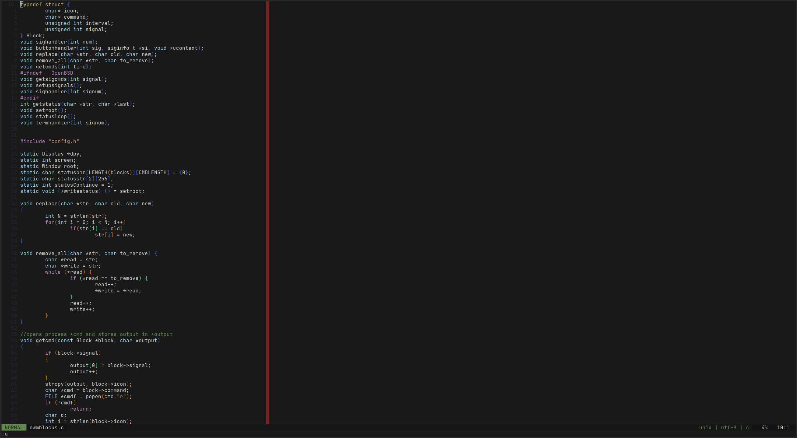

# dotfiles



My arch compatible user dotfiles.
They were originally based on the dotfiles of [lukesmithxyz](https://github.com/lukesmithxyz/voidrice).
This being some time, hundreds of commits and my personalized version of [larbs](https://github.com/TiynGER/larbs) ago, they are now quite different.

## Required and Recommended Software

All requirements and recommendations get installed by my version of LARBS.
To take a look at all the software it installs look at the [progs.csv](https://github.com/TiynGER/larbs/blob/master/progs.csv)  in my LARBS repository.

## Migration of my dotfiles to other system

- set alias in .bashrc: `alias config='/usr/bin/git --git-dir=$HOME/.dotfiles/ --work-tree=$HOME'`
- clone this repository: `git clone --bare https://github.com/Tiyn/dotfiles $HOME/.dotfiles`
- optional: backup old files:

```sh
mkdir -p .config-backup && \
config checkout 2>&1 | egrep "\s+\." | awk {'print $1'} | \
xargs -I{} mv {} .config-backup/{}
```

- checkout changes: `config checkout`
- ignore untracked files: `config config --local status.showUntrackedFiles no`
- pull current setup: `config pull`
- finish setup for vim:
  - open vim and run `:PackerCompile`, and `:PackerInstall`

The step containing commenting out is needed because the colorscheme has
problems being not available and disrupts the further process of the plugin
installation.

## Ignore local changes to config files

If you need to make local changes to config files that are not to be pushed
run `config update-index --skip-worktree <file>` to stop git from showing them
having changes.

## Hotkeys

There are various shortcuts and hotkeys used in this version. Included in my build are the following.
[Dwm](https://github.com/tiyn/dwm)s and [st](https://github.com/tiyn/st)s hotkeys can be found in their repositories.

### SXHKD

| ModKey | Shift | Key               | Function                                                  |
| ------ | ----- | ----------------- | --------------------------------------------------------- |
| Super  |       | b                 | Spawn browser                                             |
| Super  |       | f                 | Spawn filemanager                                         |
| Super  |       | i                 | (gpu-screen-record) stop recording                        |
| Super  |       | m                 | Spawn thunderbird                                         |
| Super  |       | o                 | (gpu-screen-record) start replay                          |
| Super  |       | p                 | (gpu-screen-record) save replay                           |
| Super  |       | u                 | (gpu-screen-record) start recording                       |
| Super  |       | r                 | (dmenu) dmenu\_run                                        |
| Super  | Shift | x                 | Restart sxkd                                              |
| Super  |       | F5                | Enable 2 Screen Monitor                                   |
| Super  |       | F6                | Toggle touchpad                                           |
| Super  |       | F7                | (dmenu) Mounting drives                                   |
| Super  |       | F8                | (dmenu) Unmounting drives                                 |
| Super  |       | F9                | Restart NetworkManager                                    |
| Super  |       | F10               | (dmenu) Prompt, if yes: slock                             |
| Super  |       | F11               | (dmenu) Prompt, if yes: reboot                            |
| Super  |       | F12               | (dmenu) Prompt, if yes: shutdown                          |
| Super  |       | Print             | (dmenu) Prompt to take a screenshot                       |
| Super  |       | Return            | Spawn terminal                                            |
|        |       | AudioMute         | Volume mute                                               |
|        |       | AudioMicMute      | Mic Mute                                                  |
|        |       | AudioLowerVolume  | Volume lower                                              |
|        |       | AudioRaiseVolume  | Volume raise                                              |
|        |       | MonBrightnessDown | Brightness decrease                                       |
|        |       | MonBrightnessUp   | Brightness increase                                       |


## Additional configs

Additional configs (and for example firefox plugins) can be found in my [wiki](https://github.com/tiyn/wiki).
